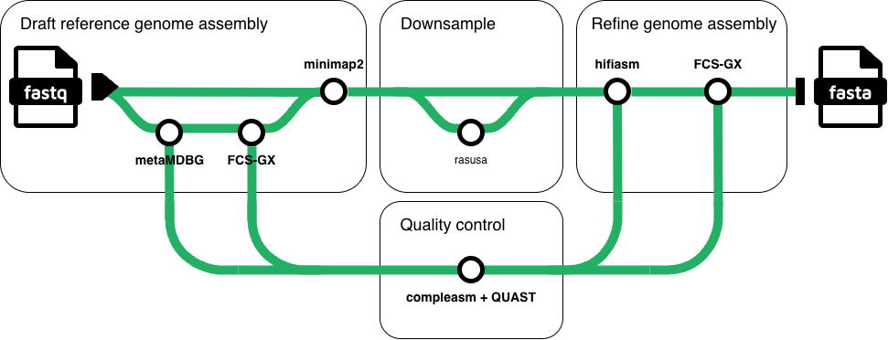

# target-asm

Target eukaryotic genome assembly from contaminated PacBio HiFi read sets.

`target-asm` is a Nextflow DSL2 workflow for recovering target eukaryotic genomes from mixed long-read sequencing libraries. It is intended for samples where the organism of interest is sequenced together with host, symbiont, microbial, environmental, or culture-associated DNA.

The workflow is reference-independent with respect to the target genome. It first assembles the full read set as a metagenome, removes non-target contigs with NCBI FCS-GX, recruits original reads that support the target-enriched draft, optionally downsamples those reads, reassembles with hifiasm, and runs a final FCS-GX screen.

The motivating benchmark was contaminated PacBio HiFi sequencing of obligate biotrophic oomycetes, but the strategy is not oomycete-specific. Any eukaryotic target with an appropriate NCBI taxonomy ID for FCS-GX can be used.

## Workflow



1. `metaMDBG` assembles the input HiFi reads as a metagenome.
2. `FCS-GX` removes contigs outside the requested target taxon.
3. `minimap2` maps the original HiFi reads back to the cleaned draft.
4. `samtools` extracts mapped reads for target-enriched reassembly.
5. `rasusa` optionally downsamples mapped reads to a target base count.
6. `hifiasm` reassembles the recruited reads.
7. `FCS-GX` runs a final contamination screen.
8. Optional `Compleasm` and `QUAST` reports track assembly quality across steps.

## Requirements

- Nextflow
- One of Docker, Singularity, or Apptainer
- PacBio HiFi reads in fastq.gz format
- An NCBI FCS-GX database
- An NCBI taxonomy ID for the target clade

All workflow tools are configured as containers in `nextflow.config`.

## Get the Workflow

```bash
git clone https://github.com/Yixuan39/target-asm.git
cd target-asm
nextflow run main.nf --help
```

## Quick Start

```bash
nextflow run main.nf \
  --reads /path/to/sample.fastq.gz \
  --gx_db /path/to/fcs-gx-db-prefix \
  --tax_id <target_ncbi_tax_id> \
  --target_bases <expected_genome_size> \
  --outdir results \
  -profile apptainer
```

Set `--tax_id` to the NCBI taxonomy ID for the target organism or target clade. Adjust `--target_bases` to the expected genome size multiplied by the desired coverage. For example, a 90 Mb genome at 60x coverage is `5.4e9`.

To use all mapped reads for hifiasm reassembly, omit `--target_bases`.

## When to Use target-asm

Use `target-asm` when contamination is too complex for read-length filtering or whole-library assembly alone. It is designed for cases where:

- the target is a eukaryote represented by a minority or mixed fraction of reads;
- contaminant reads overlap the target reads in length or quality;
- a close reference genome is unavailable or should not drive assembly;
- taxonomic cleaning plus read recruitment is preferable to manual contig filtering.

For clean single-organism HiFi libraries, running hifiasm directly is usually enough.

## Parameters

| Parameter | Required | Default | Description |
| --- | --- | --- | --- |
| `--reads` | yes | `null` | PacBio HiFi reads, compressed as `.fastq.gz`. |
| `--gx_db` | yes | `null` | Path prefix for the NCBI FCS-GX database. |
| `--tax_id` | yes | `null` | NCBI taxonomy ID used as the target taxon for FCS-GX. |
| `--target_bases` | no | `null` | Number of bases to retain with rasusa before hifiasm reassembly. |
| `--rasusa_seed` | no | `0` | Random seed for rasusa. |
| `--threads` | no | `24` | CPU threads used by threaded processes. |
| `--fcs_gx_memory` | no | `512 GB` | Memory requested for each FCS-GX process. |
| `--hifiasm_option` | no | `-l 2` | Extra options passed to hifiasm. |
| `--outdir` | no | `.` | Output directory for published files. |
| `--keep_intermediates` | no | `false` | Publish intermediate assemblies and mapped reads. |
| `--quality_library` | no | `null` | Compleasm database path. Enables assembly QC when supplied. |
| `--quality_lineage` | with QC | `''` | Compleasm lineage name. |
| `--help` | no | `false` | Print command-line help. |

## Quality Control

Add Compleasm and QUAST summaries to a full workflow run:

```bash
nextflow run main.nf \
  --reads /path/to/sample.fastq.gz \
  --gx_db /path/to/fcs-gx-db-prefix \
  --tax_id <target_ncbi_tax_id> \
  --target_bases 5.4e9 \
  --quality_library /path/to/compleasm_db \
  --quality_lineage <busco_lineage> \
  --outdir results \
  -profile apptainer
```

When QC is enabled, target-asm evaluates the metaMDBG assembly, the first FCS-GX-cleaned assembly, the hifiasm assembly, and the final FCS-GX-cleaned assembly.

## Outputs

With the default settings, the main output is:

```text
results/
  <sample>.fasta.gz
  fcs_gx/
    fcs_initial.fcs_gx_report.txt
    fcs_final.fcs_gx_report.txt
```

When `--quality_library` and `--quality_lineage` are provided:

```text
results/
  quality/
    quality_trace.csv
    quality_final.csv
```

When `--keep_intermediates` is set, target-asm also publishes intermediate outputs under `metaMDBG/`, `minimap2/`, `rasusa/`, `hifiasm/`, and `fcs_gx/`.

## Profiles

The workflow includes these profiles:

| Profile | Description |
| --- | --- |
| `standard` | Local execution. |
| `slurm` | SLURM execution. |
| `docker` | Enable Docker containers. |
| `singularity` | Enable Singularity containers with automounts. |
| `apptainer` | Enable Apptainer containers with automounts. |

Profiles can be combined, for example `-profile slurm,apptainer`, when running on a SLURM cluster. On SLURM systems, the `slurm` profile is recommended because only the FCS-GX steps require high-memory nodes, while the remaining workflow steps can run with ordinary scheduler resources.

## Notes

- NCBI recommends 512 GiB shared memory for FCS-GX with the standard database; running below this can be extremely slow. target-asm requests `--fcs_gx_memory '512 GB'` by default.
- `target-asm` removes non-target taxonomic contamination, but target-derived organellar contigs may remain and should be handled downstream if nuclear-only assemblies are required.
- For the downy mildew benchmark, Oomycota was used as the target clade (`--tax_id 4762`) and `stramenopiles` was used for Compleasm QC. For other targets, choose the matching NCBI taxon and Compleasm/BUSCO lineage.
