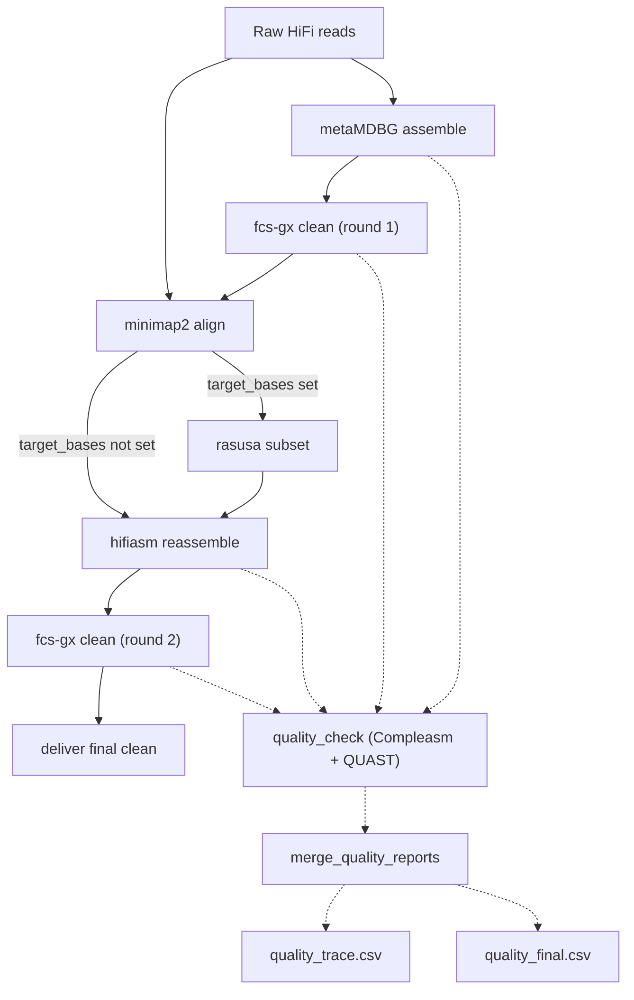

# TEA (Target Eukaryotic genome Assembly)

A reference-independent framework for the assembly of high-quality eukaryotic genomes from complex and contaminated metagenomic samples.

## Workflow Overview

1. **metamdbg_assemble** – Builds an initial draft assembly from the supplied HiFi reads.
2. **fcs_gx_clean (round 1)** – Screens the draft assembly against the configured GX database and removes contaminants.
3. **minimap2_align** – Maps the original reads back to the cleaned draft to retain only well-supported sequences.
4. **rasusa_subset** *(optional)* – Downsamples mapped reads to the requested number of bases; skipped if `--target_bases` is not set.
5. **hifiasm_reassemble** – Re-assembles the filtered reads to improve structural accuracy.
6. **fcs_gx_clean (round 2)** – Performs a final contamination screen on the polished assembly to generate the release-ready genome.
7. **deliver_final_clean** – Copies the final FCS-cleaned assembly to the requested output directory with a stable filename.
8. **quality_check** *(optional)* – When `--quality_library` and `--quality_lineage` are provided, Compleasm + QUAST run on the metaMDBG, initial FCS, hifiasm, and final FCS assemblies.
9. **merge_quality_reports** *(optional)* – Combines QC metrics into `quality_trace.csv` (all steps) and `quality_final.csv` (final assembly).

## Workflow DAG



## Quick Start

```bash
nextflow run main.nf \
    --reads /path/to/sample.fastq.gz \
    --gx_db /path/to/gx-db-prefix \
    --tax_id 4762 \
    --outdir results \
    -profile slurm
```

### Optional Parameters

```bash
# Subsample reads to target bases (e.g., genome_size * coverage)
nextflow run main.nf ... --target_bases 5e9

# Keep intermediate files (draft assemblies, mapped reads)
nextflow run main.nf ... --keep_intermediates

# Run quality check with Compleasm + QUAST
nextflow run main.nf ... \
    --quality_library /path/to/compleasm_db \
    --quality_lineage stramenopiles

# Customize hifiasm and rasusa
nextflow run main.nf ... \
    --hifiasm_option '-l 2' \
    --rasusa_seed 123
```

Adjust `params.threads` or other parameters in `nextflow.config` to tailor the run to your system.
