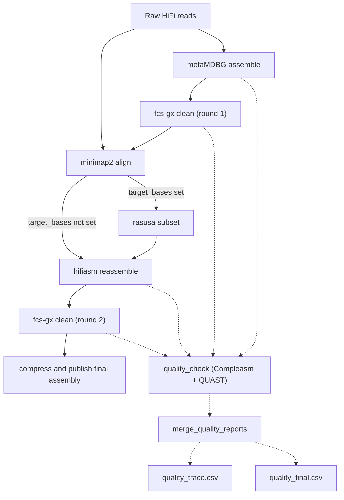

# targetasm

A reference-independent framework for the assembly of high-quality eukaryotic genomes from complex and contaminated metagenomic samples.

## Workflow Overview

1. **metaMDBG** builds a draft assembly from PacBio HiFi reads.
2. **FCS-GX** screens and cleans the draft.
3. **minimap2 + samtools** recruit primary mapped reads.
4. **rasusa** optionally subsamples to `--target_bases`.
5. **hifiasm + gfatools** reassemble recruited reads and convert GFA to FASTA.
6. **FCS-GX** performs the final screen and publishes the cleaned assembly.
7. **Compleasm + QUAST** optionally evaluate all four assembly stages and produce combined CSV reports.

The development version reuses 11 pinned nf-core modules. See the
[module migration notes](docs/module-migration.md) for versions, behavior changes,
remaining local code, and validation commands.

## Workflow DAG



## Quick Start

```bash
nextflow run main.nf \
    --reads /path/to/sample.fastq.gz \
    --gx_db /path/to/gx-db-directory \
    --tax_id 4762 \
    --outdir results \
    -profile slurm,apptainer
```

Requires **Nextflow ≥26.04** and a supported container engine (or Conda).
Parameters are validated with the pinned `nf-schema@2.7.2` plugin and
[`nextflow_schema.json`](nextflow_schema.json). Run `nextflow run main.nf --help`
to see parameter help and download the plugin before using an offline environment.
Unknown parameters and invalid inputs are rejected before tasks start.
`--gx_db` must be a directory containing the complete FCS-GX database bundle.
Use `-profile docker` locally, or combine an executor and container profile on HPC.

### Optional Parameters

```bash
# Subsample reads to target bases (e.g., genome_size * coverage)
nextflow run main.nf ... --target_bases 5e9

# Keep intermediate files (draft assemblies, mapped reads)
nextflow run main.nf ... --keep_intermediates

# Run quality check with Compleasm + QUAST
nextflow run main.nf ... \
    --quality_library /path/to/compleasm_db \
    --quality_lineage stramenopiles

# Customize hifiasm and rasusa
nextflow run main.nf ... \
    --hifiasm_option '-l 2' \
    --rasusa_seed 123
```

Set `--threads` on the command line. Resources are in `conf/base.config`;
tool arguments and publication rules are in `conf/modules.config`. Provide
cluster-specific queues and resource overrides through `-c site.config`.

## Outputs

- `<outdir>/<sample>.fasta.gz`: final clean assembly (sample uses `reads.simpleName`).
- `<outdir>/fcs_gx/`: initial and final FCS-GX reports.
- `<outdir>/quality/quality_trace.csv`: QC across the four assembly stages, when enabled.
- `<outdir>/quality/quality_final.csv`: final assembly QC, when enabled.
- `<outdir>/pipeline_info/`: module-reported software versions and execution trace.

`--keep_intermediates` also publishes the draft, initially cleaned assembly,
recruited reads, optional subsampled reads and hifiasm assembly.

## Development checks

```bash
nextflow run main.nf --help
python3 -m unittest discover -s tests -p 'test_*.py'
python3 tests/run_stub.py
```

The stub suite needs Nextflow and nf-test; it does not run the assembly tools.
See [validation details](docs/module-migration.md#checks) for the real tool tests
and [SC1982 smoke validation](docs/sc1982-smoke.md) for the small real-data run.
