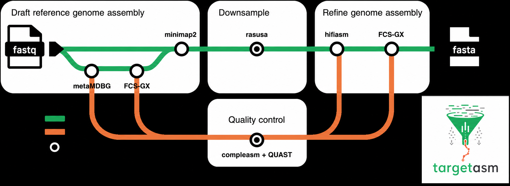

# targetasm

Target eukaryotic genome assembly from contaminated PacBio HiFi read sets.

`targetasm` is a Nextflow DSL2 workflow for recovering target eukaryotic genomes from mixed long-read sequencing libraries. It is intended for samples where the organism of interest is sequenced together with host, symbiont, microbial, environmental, or culture-associated DNA.

The workflow is reference-independent with respect to the target genome. It first assembles the full read set as a metagenome, removes non-target contigs with NCBI FCS-GX, recruits original reads that support the target-enriched draft, optionally downsamples those reads, reassembles with hifiasm, and runs a final FCS-GX screen.

The motivating benchmark was contaminated PacBio HiFi sequencing of obligate biotrophic oomycetes, but the strategy is not oomycete-specific. Any eukaryotic target with an appropriate NCBI taxonomy ID for FCS-GX can be used.

> **Development version (`0.2.0dev`).** This branch rebuilds the workflow on 11 pinned nf-core modules. See the [module migration notes](docs/module-migration.md) for tool versions, behavior changes, and the code that remains local.

## Workflow



1. `metaMDBG` assembles the input HiFi reads as a metagenome.
2. `FCS-GX` removes contigs outside the requested target taxon.
3. `minimap2` maps the original HiFi reads back to the cleaned draft.
4. `samtools` extracts primary mapped reads for target-enriched reassembly.
5. `rasusa` optionally downsamples mapped reads to a target base count.
6. `hifiasm` reassembles the recruited reads; `gfatools` converts the primary contigs to FASTA.
7. `FCS-GX` runs a final contamination screen.
8. Optional `Compleasm` and `QUAST` reports track assembly quality across the four assembly stages.

## Requirements

- Nextflow ≥ 26.04
- One of Docker, Singularity, Apptainer, or Conda
- PacBio HiFi reads in `.fastq.gz` format (one sample per run)
- A directory containing the complete NCBI FCS-GX database bundle
- An NCBI taxonomy ID for the target clade

Tool containers and Conda environments come from the pinned nf-core modules. Parameters are validated with the `nf-schema@2.7.2` plugin against [`nextflow_schema.json`](nextflow_schema.json); unknown parameters and invalid inputs are rejected before any task starts. Run `--help` once to download the plugin before using an offline environment.

## Get the Workflow

```bash
git clone -b dev https://github.com/Yixuan39/targetasm.git
cd targetasm
nextflow run main.nf --help
```

## Quick Start

```bash
nextflow run main.nf \
  --reads /path/to/sample.fastq.gz \
  --gx_db /path/to/gx-db-directory \
  --tax_id <target_ncbi_tax_id> \
  --target_bases <expected_genome_size> \
  --outdir results \
  -profile slurm,apptainer
```

Set `--tax_id` to the NCBI taxonomy ID for the target organism or target clade. Adjust `--target_bases` to the expected genome size multiplied by the desired coverage. For example, a 90 Mb genome at 60x coverage is `5.4e9`.

To use all mapped reads for hifiasm reassembly, omit `--target_bases`.

The sample name is taken from the reads filename (`sample.fastq.gz` → `sample`) and must start with a letter or number and contain only letters, numbers, dots, underscores, and hyphens.

## When to Use targetasm

Use `targetasm` when contamination is too complex for read-length filtering or whole-library assembly alone. It is designed for cases where:

- the target is a eukaryote represented by a minority or mixed fraction of reads;
- contaminant reads overlap the target reads in length or quality;
- a close reference genome is unavailable or should not drive assembly;
- taxonomic cleaning plus read recruitment is preferable to manual contig filtering.

For clean single-organism HiFi libraries, running hifiasm directly is usually enough.

## Parameters

| Parameter | Required | Default | Description |
| --- | --- | --- | --- |
| `--reads` | yes | `null` | PacBio HiFi reads, compressed as `.fastq.gz`. |
| `--gx_db` | yes | `null` | Directory containing the complete FCS-GX database bundle. |
| `--tax_id` | yes | `null` | NCBI taxonomy ID used as the target taxon for FCS-GX. |
| `--outdir` | yes | `.` | Output directory for published files. |
| `--target_bases` | no | `null` | Number of bases to retain with rasusa before hifiasm reassembly (e.g. `5e9`). |
| `--rasusa_seed` | no | `0` | Random seed for rasusa. |
| `--threads` | no | `24` | Maximum CPU threads for threaded processes. |
| `--hifiasm_option` | no | `-l 2` | Extra options passed to hifiasm; `--primary` is always added. |
| `--keep_intermediates` | no | `false` | Publish intermediate assemblies and recruited reads. |
| `--quality_library` | no | `null` | Local Compleasm lineage library. Enables assembly QC when supplied. |
| `--quality_lineage` | with QC | `''` | Compleasm lineage name. |
| `--help` | no | `false` | Print parameter help and exit. |

Process resources live in [`conf/base.config`](conf/base.config); tool arguments and publishing rules live in [`conf/modules.config`](conf/modules.config). Override queues, memory, or other site settings with `-c site.config`.

## Quality Control

Add Compleasm and QUAST summaries to a full workflow run:

```bash
nextflow run main.nf \
  --reads /path/to/sample.fastq.gz \
  --gx_db /path/to/gx-db-directory \
  --tax_id <target_ncbi_tax_id> \
  --target_bases 5.4e9 \
  --quality_library /path/to/compleasm_db \
  --quality_lineage <busco_lineage> \
  --outdir results \
  -profile slurm,apptainer
```

When QC is enabled, targetasm evaluates the metaMDBG assembly, the first FCS-GX-cleaned assembly, the hifiasm assembly, and the final FCS-GX-cleaned assembly.

To QC existing assemblies without running the full workflow, use the standalone helper. It runs Compleasm and QUAST on each FASTA and merges the results into one table:

```bash
nextflow run run_fasta_quality_table.nf \
  --fasta '/path/to/*.fasta.gz' \
  --output quality.tsv \
  --quality_library /path/to/compleasm_db \
  --quality_lineage <busco_lineage> \
  -profile apptainer
```

## Outputs

With the default settings, the main output is:

```text
results/
  <sample>.fasta.gz
  fcs_gx/
    <sample>.fcs_initial.fcs_gx_report.txt
    <sample>.fcs_final.fcs_gx_report.txt
  pipeline_info/
    execution_trace.tsv
    software_versions.tsv
```

When `--quality_library` and `--quality_lineage` are provided:

```text
results/
  quality/
    quality_trace.csv
    quality_final.csv
```

When `--keep_intermediates` is set, targetasm also publishes the metaMDBG draft (`metaMDBG/`), the first FCS-GX-cleaned assembly (`fcs_gx/`), recruited reads (`minimap2/`), subsampled reads (`rasusa/`, if used), and the hifiasm assembly (`hifiasm/`).

## Profiles

| Profile | Description |
| --- | --- |
| `standard` | Local execution. |
| `slurm` | SLURM execution. |
| `docker` | Enable Docker containers. |
| `singularity` | Enable Singularity containers with automounts. |
| `apptainer` | Enable Apptainer containers with automounts. |
| `conda` | Use Conda environments instead of containers. |

Profiles can be combined, for example `-profile slurm,apptainer`, when running on a SLURM cluster. On SLURM systems, the `slurm` profile is recommended because only the FCS-GX screening steps require high-memory nodes, while the remaining workflow steps can run with ordinary scheduler resources.

## Notes

- NCBI recommends 512 GiB shared memory for FCS-GX with the standard database; running below this can be extremely slow. targetasm requests `500 GB` for `FCSGX_RUNGX` by default. The `--fcs_gx_memory` parameter from 0.1.0 has been removed; change this with a `-c` config instead:

  ```groovy
  process {
      withName: FCSGX_RUNGX { memory = '700 GB' }
  }
  ```

- `targetasm` removes non-target taxonomic contamination, but target-derived organellar contigs may remain and should be handled downstream if nuclear-only assemblies are required.
- For the downy mildew benchmark, Oomycota was used as the target clade (`--tax_id 4762`) and `stramenopiles` was used for Compleasm QC. For other targets, choose the matching NCBI taxon and Compleasm/BUSCO lineage.

## Development Checks

```bash
nextflow run main.nf --help
python3 -m unittest discover -s tests -p 'test_*.py'
python3 tests/run_stub.py
```

The stub suite needs Nextflow and nf-test; it does not run the assembly tools. See [validation details](docs/module-migration.md#checks) for the real tool tests and [SC1982 smoke validation](docs/sc1982-smoke.md) for the small real-data run.
